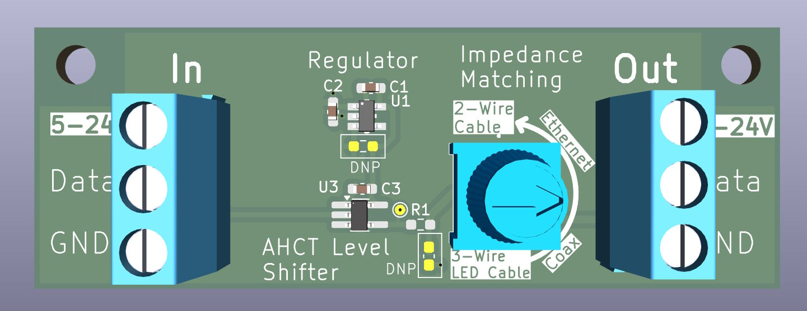

# Universal level shifter

This project contains KiCAD files for a 3-3V->5V level shifter that can drive aribtrary impedance lines using a potentiometer to continously adjust impedance. Labels are provided for typical wire types, including 3-wire cable, 75 ohm coax, 100 ohm twisted pair, and higher impedance 2-wire cables.  
